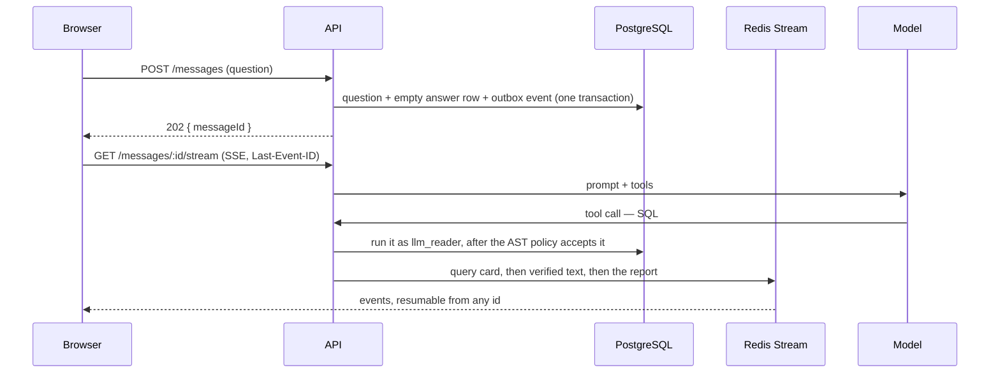

# Financial Chat Assistant

A chat application for asking questions about the revenue and income of U.S.
public companies. Answers are produced by querying a PostgreSQL database, and
**every figure in an answer is checked against the query results before it
reaches the screen** — a number the data cannot support is never shown. When the
dataset does not cover a question, the assistant says so instead of estimating.


## What it does

- **Streams an answer** token by token, with the SQL it ran shown above the
  sentences built on it — the query, its row count, its duration and its rows.
- **Refuses to state a figure it cannot support.** The check runs _while_ the
  answer streams, so an unsupported number is stopped mid-sentence rather than
  corrected afterwards. Every finished answer carries a badge saying what was
  checked.
- **Says what the dataset does not have**, for a company, a year or a metric,
  and says what it has instead — after querying, so the refusal is a fact rather
  than a guess.
- **Renders more than prose**: a table when the answer compares things, a line or
  bar chart when it moves over time, both drawn only from figures that passed.
- **Survives a reload.** Generation is detached from the connection that asked
  for it, so refreshing mid-answer reattaches to the one already running instead
  of asking again. Closing the tab does not stop it; the Stop button does.
- **Costs something, and says so.** Each question holds the worst it could cost
  before it starts and settles the real amount when it ends, against a
  configurable per-user cap in a fixed window.
- **Keeps accounts apart.** Someone else's conversation is indistinguishable
  from one that does not exist.

## Quick start

```bash
pnpm install
cp .env.example .env      # fill in OPENAI_API_KEY
pnpm infra:up             # PostgreSQL 18 on :5432, Redis 8 on :6379
pnpm db:seed              # load the financial dataset, grants and indexes
pnpm db:migrate           # create the application tables
pnpm dev                  # api :3000 + web :5173
```

Open <http://localhost:5173>, register, and ask something. `pnpm db:verify`
proves the data and the privilege model are as designed, and `pnpm check`
(format, types, lint, boundaries, dead code, migrations, unit tests) runs
without any container at all.

Any OpenAI-compatible endpoint works, provided the model supports **streaming
and tool calling** — a model that ignores `tools` will hold a perfectly fluent
conversation and answer nothing from the data, so a check at startup asks the
endpoint and logs what it found.

## Architecture at a glance



Four things that shape everything else:

- **A generation outlives the request that started it.** The command writes the
  question, the row its answer goes in, and an outbox event in one transaction;
  a runner produces events into a Redis Stream; clients attach and resume with
  `Last-Event-ID`. Stopping is an explicit `POST /messages/:id/stop`, not a
  closed socket.
- **SQL from the model is a parse tree before it is a statement.** It is parsed
  with PostgreSQL's own parser, walked against an allowlist, and only the
  deparsed canonical form is executed — as `llm_reader`, which can `SELECT` one
  table and nothing else.
- **The claim gate sits between the model and the socket.** Text is held until
  the number inside it is complete and matched against the tool results.
- **Money is an integer count of micro-USD**, held before a generation and
  settled after, atomically in Redis with the ledger in PostgreSQL.

## How grounding works

The heart of the project, in the order it happens:

1. **The catalog is read from the database**, at startup and every ten minutes:
   which companies, which years, which columns and what they mean. Nothing in
   the code hardcodes the coverage, so replacing the dataset moves the prompt,
   the refusals and the verifier together.
2. **The model asks for data before it says anything.** Two tools: one runs a
   `SELECT`, one describes what the dataset covers. Both results carry
   pre-formatted `display` strings, so the number in the sentence and the number
   in the evidence are the same decision.
3. **Every figure is checked as it streams.** The gate releases text only once
   the reading of it can no longer change, matches each numeric claim against
   the tool results at the tolerance the display band implies, and holds
   anything it cannot yet decide. A table and a fenced code block are held
   whole, because a leading-cell rank needs the row count and a fence means
   whatever its closing line says.
4. **A draft that breaks the rule is discarded, not corrected.** The verifier
   reads the finished draft; a failure sends the model back with the reason,
   up to three drafts.
5. **The last resort has a last resort.** If no draft passes, the answer is
   assembled from the query results themselves — and that assembly is verified
   too, degrading to a sentence with no figures if it has to.

A refusal is a claim as well. Saying "this dataset does not have it" without
having run a query is refused exactly like an unsupported figure:


The badge under an answer says which of these happened:

| Badge                          | Meaning                                                       |
| ------------------------------ | ------------------------------------------------------------- |
| `Verified · N figures checked` | Every figure in the answer was matched against a query result |
| `No figures to verify`         | The answer states no figures — a refusal, usually             |
| `Showing verified data only`   | No draft passed, so this is assembled from the rows           |
| `Stopped before it finished`   | Someone pressed Stop; what had been verified is kept          |

## The scenarios

| #      | Scenario                          | How to see it                                                             | Where it lives                                                    |
| ------ | --------------------------------- | ------------------------------------------------------------------------- | ----------------------------------------------------------------- |
| **S1** | Ask a question                    | "How did Nvidia's revenue change from 2022 to 2025?"                      | `apps/api/src/generation/`, `apps/web/src/domains/conversation/`  |
| **S2** | A question the data cannot answer | "What was Berkshire Hathaway's revenue in 2023?"                          | `packages/grounding/` (the refusal is verified too)               |
| **S3** | Stop mid-answer                   | Ask something broad, press Stop — the query cards and verified text stay  | `POST /messages/:id/stop`, `apps/api/src/generation/application/` |
| **S4** | Exceed the usage limit            | `USAGE_LIMIT_USD=0.001`, `USAGE_WINDOW_SECONDS=180`, restart, ask twice   | `apps/api/src/budget/`, `apps/web/src/domains/usage/`             |
| **S5** | Leave and come back               | Reload **mid-answer**: it reattaches and finishes, and does not ask again | `apps/web/src/domains/conversation/` over `Last-Event-ID`         |
| **S6** | Delete a conversation             | Menu → Delete → confirm; cancel does nothing                              | Outbox event → worker → purge, `apps/api/src/conversation/`       |

`pnpm test:e2e` drives S1, S2, S3, S5 and S6 in a real browser against the real
model, plus account isolation and the composer. **S4 is checked by hand on
purpose**: reaching it means running the whole stack at a tenth of a cent, which
the other seven tests in that suite cannot survive. This is what it looks like —
a sentence, a reset time and a paused composer, never a raw error:


## The dataset

One table, `financial_data`, with 192 rows: **49 companies across fiscal years
2022–2025**. Columns: `company`, `ticker`, `sector`, `year`, `revenue`,
`net_income`, `operating_income`, `gross_profit`. All monetary values are USD.

Coverage is deliberately narrow, and the gaps are part of the problem the
assistant has to handle honestly:

- Two companies have only two years of data; the rest have four.
- Many values are `NULL` — several banks have no revenue recorded, and one card
  network has no net income. `NULL` means _not recorded_, never zero.
- Questions about other companies, other years, or metrics that are not in the
  table (earnings per share, cash flow, share price) have no answer here.

## Database roles

Three roles with separate jobs, created when the container first starts:

| Role          | Purpose                                                                                                                                    |
| ------------- | ------------------------------------------------------------------------------------------------------------------------------------------ |
| `app`         | Owns the schema. Used only by migrations and seeds.                                                                                        |
| `app_runtime` | Reads and writes application tables. No DDL. The API connects as this role.                                                                |
| `llm_reader`  | `SELECT` on `financial_data` and nothing else. Read-only at the transaction level, with a 3-second statement timeout and a connection cap. |

Every SQL statement generated by the language model executes as `llm_reader`, so
a flaw in the application-level guard still cannot write data, reach another
table, or run an expensive query.

## Configuration

`.env.example` documents every variable and works as-is against the local Docker
stack. The ones worth a decision:

| Variable                    | Default                     | Meaning                                                                      |
| --------------------------- | --------------------------- | ---------------------------------------------------------------------------- |
| `OPENAI_BASE_URL`           | `https://api.openai.com/v1` | Any OpenAI-compatible endpoint                                               |
| `OPENAI_MODEL`              | `gpt-5.6-luna`              | Must support streaming and tool calling; a router alias is fine (see below)  |
| `USAGE_LIMIT_USD`           | `1`                         | Spending cap per user within one window                                      |
| `USAGE_WINDOW_SECONDS`      | `3600`                      | Length of the fixed window before the cap resets                             |
| `SENDS_PER_MINUTE`          | `6`                         | Burst limit per person — the budget stops what is costly, this what is loud  |
| `PRICING_PATH`              | _(unset)_                   | A JSON file of model prices, for an endpoint the shipped table does not know |
| `OUTBOX_JOB_RETENTION_DAYS` | `7`                         | How long a finished `generation.requested` row is kept                       |
| `COOKIE_SECURE`             | `false`                     | Set to `true` when served over HTTPS                                         |

**An alias such as `auto` works.** The startup capability check asks the
endpoint what it resolved to and the budget prices the hold with that name — so
a router is priced by what it actually served, not by the alias. A model that is
in no price table is charged at the dearest rate in it, which is safe but may
refuse the first question outright: raise `USAGE_LIMIT_USD` or supply
`PRICING_PATH`.

## Scripts

| Command                   | Description                                                      |
| ------------------------- | ---------------------------------------------------------------- |
| `pnpm infra:up`           | Start PostgreSQL and Redis, waiting until both are healthy       |
| `pnpm infra:down`         | Stop the containers, keeping data                                |
| `pnpm infra:reset`        | Stop the containers and delete their volumes                     |
| `pnpm infra:logs`         | Follow container logs                                            |
| `pnpm db:seed`            | Load the dataset, apply grants, create indexes                   |
| `pnpm db:verify`          | Check the data and the privilege model                           |
| `pnpm db:generate`        | Write a migration from the schema                                |
| `pnpm db:migrate`         | Apply migrations as the schema owner                             |
| `pnpm db:check`           | `drizzle-kit check` — two branches that both wrote a migration   |
| `pnpm check`              | Build, format, types, lint, migrations and unit tests — the gate |
| `pnpm format`             | Apply Prettier (`format:check` only reports)                     |
| `pnpm typecheck`          | `tsc --noEmit` per package, tests included                       |
| `pnpm lint`               | ESLint, then dependency-cruiser, then knip                       |
| `pnpm test`               | Vitest, unit only — no Docker needed (`test:watch`)              |
| `pnpm test:integration`   | Against a real PostgreSQL and Redis — needs Docker               |
| `pnpm test:coverage`      | Both suites with coverage — needs Docker                         |
| `pnpm eval`               | The grounding quality gate (also inside `pnpm test`)             |
| `pnpm audit`              | Advisories at high or above                                      |
| `pnpm contracts:snapshot` | Re-record the published contract surface after a safe change     |
| `pnpm build`              | Emit `dist/` for every package, in dependency order              |
| `pnpm dev`                | Build once, then the API on `:3000` and the web app on `:5173`   |

Three more need the stack up and are deliberately outside `pnpm check`: one
drives a browser, one spends real money, and one stops a database.

```bash
pnpm test:e2e     # S1, S2, S3, S5, S6 and isolation, in a real browser
pnpm eval:live    # the golden questions through the real model — spends money
pnpm drill redis  # stop a dependency under a running API and watch it recover
pnpm drill postgres
```

### Running the built artefacts

```bash
pnpm build                        # packages + the API's dist/
pnpm --filter @fca/web build      # the browser bundle
pnpm --filter @fca/api start      # the API from dist/, reading ../../.env
pnpm --filter @fca/web preview    # the built page on :4173, proxying to the API
```

Worth doing once before delivering anything: the dev server and the built page
are not the same artefact, and only this run exercises the second one.

## Project structure

```text
apps/api/            NestJS on Fastify — see its README
apps/web/            Vite + React browser client — see its README
packages/domain/     Framework-free business rules — see its README
packages/contracts/  Every HTTP body and SSE event, shared by API and web
packages/grounding/  What a figure means and what the results prove — see its README
packages/config/     Environment parsing and typed configuration
data/                SQL dump, grants and indexes for the financial dataset
evals/               The grounding quality gate — see its README
e2e/                 Playwright: the scenarios, in a browser, against the real stack
infra/               Docker Compose stack and database bootstrap scripts
scripts/             Seeding, verification, the failure drills, the live eval
tools/               Lint rules, boundary fixtures, and the gates that are tests
docs/                The screenshots in this README
AGENTS.md            Operating rules for AI assistants working in this repository
CONTRIBUTING.md      How to extend it: tools, providers, metrics, events, contexts
```

### How the layers are kept apart

`packages/*` are framework-free: no NestJS, Drizzle, `pg`, `ioredis`, React or
Fastify may be imported there; inside `apps/api` a layer may only depend inwards
(`presentation → application → domain`); and inside `apps/web` a capability is
reached only through `domains/<name>/index.ts`, never sideways into another
domain and never past the entrance into a file that was meant to stay internal.
All three live in `.dependency-cruiser.cjs` and fail `pnpm lint`, because an
architecture that is only written down in a README is one convenient import away
from being untrue.

The rules are themselves tested: `tools/architecture/` holds a small source tree
that breaks them on purpose, and a test asserts each violation is reported. If a
config change quietly stops catching them, that test fails.

## Tests and gates

| Gate                             | What it holds                                                                                 |
| -------------------------------- | --------------------------------------------------------------------------------------------- |
| `pnpm check` (CI, every push)    | Build, format, types, ESLint, boundaries, dead code, `drizzle-kit check`, and the unit suites |
| `pnpm test:integration` (CI)     | Persistence, Redis scripts and every database constraint, against real servers                |
| `pnpm eval` (inside `pnpm test`) | 128 grounding cases: verdict, reason, gate/verifier agreement, and refusal recall at 100%     |
| `pnpm test:e2e` (by hand)        | The scenarios in Chromium against the real model                                              |
| `pnpm drill` (by hand)           | Stop Redis or PostgreSQL under a running API and watch readiness recover without a restart    |
| `pnpm eval:live` (by hand)       | The golden questions through the real model: repairs, queries per answer, first token, cost   |

Coverage is held at **95% on statements, branches, functions and lines** for
`packages/*`, `apps/api` and `apps/web` alike, measured with the integration
suite included — persistence is proven against a real PostgreSQL, and measuring
without it would report the most heavily tested layer as untested.

Some gates exist to catch the things review does not: a contract snapshot that
classifies every change to the published surface and counts anything it has not
been taught as breaking; a secret scan over every tracked file; a check that
each domain event type has a subscriber; a check that every command this
documentation tells you to run actually exists.

## Design decisions and trade-offs

| Decision                                           | Why, and what it costs                                                                                                                      |
| -------------------------------------------------- | ------------------------------------------------------------------------------------------------------------------------------------------- |
| Verify while streaming, not after                  | A wrong figure that reached the screen cannot be unseen. The cost is a few characters of latency, and tables and code fences held whole     |
| Discard and regenerate a bad draft, never edit it  | Editing a sentence around a number produces text nobody wrote. The cost is up to three drafts for one answer                                |
| Generation detached from the HTTP connection       | A dropped signal must not lose an answer, and a refresh must not ask twice. The cost is a Redis Stream, an outbox and a resume protocol     |
| AST allowlist **and** a read-only role             | Either alone is one bug away from a write. The cost is that a legitimate function the allowlist has not met is refused until it is added    |
| Two-phase budget in Redis, ledger in PostgreSQL    | A limit checked with a read and a write is a limit two requests can both pass. The cost is a reservation that has to be settled or released |
| Integer micro-USD everywhere                       | `0.1 + 0.2 !== 0.3`, and a drifting budget either overcharges or refuses what was paid for. The cost is conversions at the edges            |
| One contracts package, imported by both sides      | A renamed field breaks the build rather than a request. The cost is a snapshot gate to keep the published surface honest                    |
| Drizzle rather than Prisma                         | The migration is SQL somebody reads, and no engine binary. The cost is writing more of the query by hand                                    |
| The provider's SDK behind an anti-corruption layer | No SDK type escapes one directory, so a second provider is an adapter. The cost is a translation layer to maintain                          |
| Local only, by declaration                         | Deployment (images, orchestration, autoscaling) is out of scope, so nothing here pretends to be a deployment                                |

## Known gaps

Recorded rather than discovered later:

- **The browser bundle is over its budget**: 935 kB, 276 kB gzipped, against a
  180 kB target. The chart library is in nearly every answer, so loading it
  lazily would move the wait into the first question rather than remove it.
- **S4 is verified by hand**, for the reason given above.
- **One moderate advisory remains**: an esbuild dev-server issue reachable only
  through `drizzle-kit`'s own dev dependency chain. `pnpm audit` is gated at
  high; this one is dev-only and its patched version has not been released
  downstream.
- **No dashboards and no runbooks.** There is no metrics collector here, so
  observability ends at `GET /healthz/counters` and structured logs, which is
  what a single-machine system can honestly support.
- **`pnpm test:e2e` and `pnpm eval:live` are not in CI**: both need a real model,
  which means an API key and money per push, and a pull request from a fork has
  no secrets anyway.

## Troubleshooting

**Ports 5432 or 6379 already in use** — another PostgreSQL or Redis is running.
Stop it, or change the published port in `infra/docker-compose.yml`.

**`pnpm db:seed` reports that Postgres is not running** — the containers are not
up yet. Run `pnpm infra:up` first; it returns only once both are healthy.

**The database looks stale or a role is missing** — role creation happens once,
when the data volume is empty. Run `pnpm infra:reset`, then `pnpm infra:up` and
`pnpm db:seed` to start from scratch.

**Code changes have no effect, or a new route answers 404** — an older process
is still holding the port. `EADDRINUSE` does not stop the new one, so HTTP is
answered by the old process while the new one's background work runs. Stop it
with `pkill -f dist/main.js` before starting again.

**The model answers fluently but never runs a query** — that endpoint does not
support tool calling. The startup capability check says so in the log; read that
line rather than the answers.

**The first question is refused for lack of budget** — `OPENAI_MODEL` is a name
that is in no price table, so it is charged at the dearest rate as a safety
measure. Raise `USAGE_LIMIT_USD` or supply `PRICING_PATH`.

**A script gets `429`** — that is `SENDS_PER_MINUTE`, the burst limit. Honour the
`Retry-After` header in the response, as `scripts/eval-live.mjs` does.

**`pnpm test:e2e` fails during setup** — registration is throttled at ten per
five minutes per host, deliberately. Wait for the window, or check how many
accounts the run is creating.

**`pnpm install` fails with `ERR_PNPM_NO_MATURE_MATCHING_VERSION`** — working as
intended. `pnpm-workspace.yaml` sets `minimumReleaseAge` to three days, so a
package published in the last few days cannot enter the tree; a compromised
release is usually caught and yanked within that window. Either wait, or widen
the version range in `package.json` so an older release satisfies it. Do not add
the package to `minimumReleaseAgeExclude` — that removes the protection for the
one package most likely to need it.
